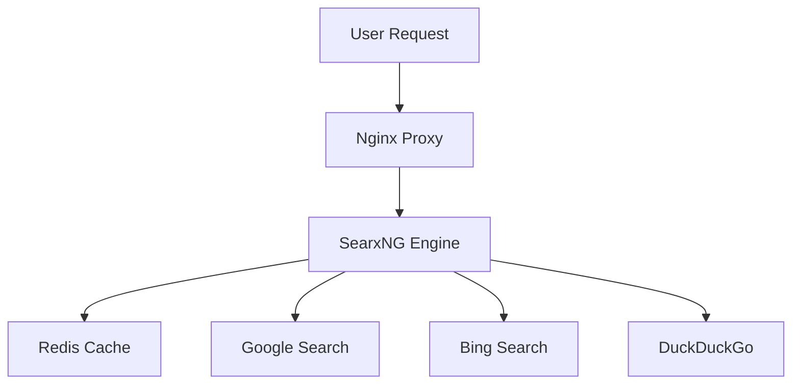

# 📌 GitHub Portfolio Setup Guide

Follow these steps to optimize your GitHub profile for DevOps/SRE roles in Switzerland.

## 🎯 Step 1: Pin Your Best Projects

### Manual Pinning (GitHub Web Interface)
1. Go to your GitHub profile: https://github.com/psimaker
2. Scroll down to the "Pinned repositories" section
3. Click "Customize your pins"
4. Select these 6 repositories to pin:
   - **homelab** - Your main infrastructure project
   - **loogi** - Search platform demonstration
   - **LOOGI.ch** - Domain-specific implementation
   - [Create empty repos for these if needed:]
   - **devops-playbook** - Documentation of your practices
   - **ai-infrastructure** - AI/ML integration examples
   - **monitoring-stack** - Monitoring setup examples

### Repository Creation (if needed)
For missing repositories, create them with:

```bash
# Create new repositories
curl -X POST -H "Authorization: token YOUR_GITHUB_TOKEN" \
  -d '{"name":"devops-playbook", "description":"DevOps best practices and runbooks", "private":false}' \
  https://api.github.com/user/repos

curl -X POST -H "Authorization: token YOUR_GITHUB_TOKEN" \
  -d '{"name":"ai-infrastructure", "description":"AI/ML infrastructure and integration examples", "private":false}' \
  https://api.github.com/user/repos

curl -X POST -H "Authorization: token YOUR_GITHUB_TOKEN" \
  -d '{"name":"monitoring-stack", "description":"Prometheus+Grafana monitoring configurations", "private":false}' \
  https://api.github.com/user/repos
```

## 🎨 Step 2: Update Profile README

1. Create a new repository named exactly `psimaker` (same as your username)
2. Add the `PROFILE_README.md` content to this repository's README.md
3. GitHub will automatically display this on your profile

**Quick setup:**
```bash
# Clone your profile repo
git clone https://github.com/psimaker/psimaker.git
cd psimaker

# Copy the optimized README
cp ../PROFILE_README.md README.md

# Commit and push
git add README.md
git commit -m "feat: Add professional profile README"
git push origin main
```

## 📊 Step 3: Enhance Repository READMEs

### For Homelab Repository
1. Replace the current README with the optimized version
2. Add proper documentation structure:
   ```bash
   cd homelab
   # Copy the new README
   cp ../README.md .
   
   # Add supporting files
   cp ../.gitignore .
   cp ../.env.example .
   
   git add README.md .gitignore .env.example
   git commit -m "docs: Professionalize repository documentation"
   git push origin main
   ```

### For LOOGI Repository
Add comprehensive documentation:
```bash
cd loogi
# Create detailed README
cat > README.md << 'EOF'
# 🔍 LOOGI Search Platform

A privacy-focused, AI-enhanced search engine built with modern DevOps practices.

## Features
- **Meta Search**: Aggregates results from multiple search engines
- **AI Enhancement**: LLM integration for improved results
- **Dockerized**: Containerized deployment with Docker Compose
- **Redis Caching**: Performance optimization with Redis
- **Secure**: No tracking, no cookies, complete privacy

## Tech Stack
- 🐳 Docker & Docker Compose
- 🔍 SearxNG search engine
- 🗄️ Redis for caching
- 🛡️ Nginx Proxy Manager
- 📊 Monitoring with Prometheus

## Quick Start
```bash
git clone https://github.com/psimaker/loogi.git
cd loogi
cp .env.example .env
# Edit .env with your configuration
docker-compose up -d
```

## Architecture


## Status
**Production Ready** - Running at https://loogi.ch/
EOF

git add README.md
git commit -m "docs: Add comprehensive documentation"
git push origin main
```

## 🌟 Step 4: Add Project Badges

Enhance your READMEs with status badges. Add to each repository's README:

```markdown

  

```

## 📈 Step 5: GitHub Profile Optimization

### Profile Settings
1. **Profile photo**: Professional headshot
2. **Bio**: "DevOps Engineer | Cloud Infrastructure | AI Integration | Docker & Kubernetes Specialist"
3. **Location**: "Switzerland"
4. **Website**: Your portfolio or LinkedIn URL

### Social Proof
- **Star your own repositories** to show initial engagement
- **Create meaningful commits** with conventional commit messages
- **Add GitHub Topics** to each repository:
  - `devops`, `docker`, `kubernetes`, `homelab`, `selfhosted`
  - `ai-ml`, `monitoring`, `automation`, `infrastructure-as-code`

## 🚀 Step 6: Continuous Maintenance

### Regular Updates
- Commit at least weekly to show active development
- Update READMEs with new features and improvements
- Keep dependencies updated in your projects

### Quality Checks
- [ ] No hardcoded secrets in any repository
- [ ] All repositories have proper .gitignore files
- [ ] README files are comprehensive and professional
- [ ] Docker images are regularly updated
- [ ] Security best practices followed

## 📞 Final Step: Share Your Profile

1. **LinkedIn**: Add your GitHub URL to your LinkedIn profile
2. **Resume**: Include specific project achievements
3. **Job Applications**: Reference your GitHub in cover letters
4. **Networking**: Share during interviews and meetings

## 🎯 Expected Outcome

After completing these steps, your GitHub profile will:
- ✅ Showcase 6 pinned professional projects
- ✅ Have an engaging profile README with badges
- ✅ Demonstrate modern DevOps practices
- ✅ Highlight AI/ML integration experience
- ✅ Appear active and well-maintained
- ✅ Impress technical hiring managers

---

**Pro Tip**: Set a calendar reminder to review and update your GitHub profile monthly to keep it fresh and relevant for recruiters.