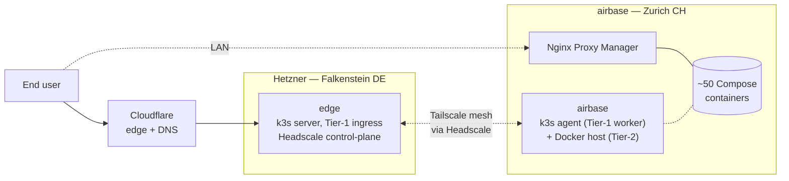

# homelab

A two-tier home infrastructure: a Kubernetes platform for new workloads, a
Docker dataplane for the stateful giants. Hosts [**loogi.ch**](https://loogi.ch)
in production.

[](https://git.psimaker.org/umut.erdem/homelab/actions/workflows/lint.yml)
[](https://git.psimaker.org/umut.erdem/homelab/actions/workflows/tofu-plan.yml)
[](https://git.psimaker.org/umut.erdem/homelab/actions/workflows/restore-test.yml)
[](LICENSE)

> *I automate things so I can spend more time breaking other things.*

## What this is

I run a search engine called **LOOGI** for real users on this infrastructure.
This repo is the source of truth for it: every node, every workload, every
secret (encrypted with SOPS+age), every architectural decision. The same
repo also captures my Tier-2 self-hosted stack — Plex, Nextcloud, Immich,
Paperless, Vaultwarden, Gitea, etc. — so there is one place to look for
"what runs at home and how is it kept honest".

Built and refined while switching career into DevOps / Platform Engineering.
The shape it has now is the shape it should have — read [`docs/architecture.md`](docs/architecture.md)
for the full design.

## Architecture in 30 seconds


```mermaid
flowchart LR
  user[End user] --> cf[Cloudflare<br/>edge + DNS]
  cf --> edge

  subgraph Hetzner_DE["Hetzner — Falkenstein DE"]
    edge["edge<br/>k3s server, Tier-1 ingress<br/>Headscale control-plane"]
  end

  subgraph Home_CH["airbase — Zurich CH"]
    direction TB
    agent["airbase<br/>k3s agent (Tier-1 worker)<br/>+ Docker host (Tier-2)"]
    npm["Nginx Proxy Manager"]
    docker[("~50 Compose<br/>containers")]
    npm --- docker
    agent -.- docker
  end

  edge <-. Tailscale mesh<br/>via Headscale .-> agent
  user -.LAN.-> npm
```

## Tiers

**Tier-1 — Platform** (Kubernetes, GitOps, fully reproducible)
Workloads: LOOGI, Pocket-ID, Headscale, observability stack, Cloudflare
Tunnel. Everything in this tier is reconciled by Flux from this repo.

**Tier-2 — Dataplane** (Docker Compose on bare-metal Debian)
Workloads: Plex, *arr, Nextcloud-AIO, Immich, Paperless, Vaultwarden,
Gitea, n8n, Syncthing, ntfy, … This is a deliberate choice — TBs of state
and longstanding setup; replatforming to k8s would be self-harm without
upside. See [`docs/adr/0001-tier1-tier2-split.md`](docs/adr/0001-tier1-tier2-split.md).

## Tour

If you have fifteen minutes and want to understand the moving parts:

| You'd like to see... | Look at... |
| --- | --- |
| The full design | [`docs/architecture.md`](docs/architecture.md) |
| All decisions and *why* | [`docs/adr/`](docs/adr/) |
| Cloud infrastructure as code | [`terraform/live/prod/`](terraform/live/prod/) |
| How nodes are configured | [`ansible/roles/`](ansible/roles/) |
| The Tier-1 platform | [`kubernetes/infrastructure/`](kubernetes/infrastructure/) |
| LOOGI deployed end-to-end | [`kubernetes/apps/loogi/`](kubernetes/apps/loogi/) |
| The Tier-2 stacks (compose snapshots) | [`compose/`](compose/) |
| What I do when an alert fires | [`docs/runbooks/`](docs/runbooks/) |
| What broke and what I learned | [`docs/postmortems/`](docs/postmortems/) |
| How secrets stay encrypted in a public repo | [`.sops.yaml`](.sops.yaml) + any `*.sops.yaml` |
| The bootstrap sequence | [`scripts/bootstrap.sh`](scripts/bootstrap.sh) |

## Stack

| Layer | Tool |
| --- | --- |
| Cloud IaC | OpenTofu 1.10 (Hetzner Object Storage state, with locking) |
| Config mgmt | Ansible (10), idempotent roles for both tiers |
| Orchestration | k3s 1.31 + Cilium 1.17 (eBPF, Hubble, Gateway API) |
| GitOps | Flux v2.4 (no UI = no clickops) |
| Reverse proxy | Traefik v3.3 (Tier-1) · Nginx Proxy Manager (Tier-2) |
| TLS | cert-manager + Let's Encrypt DNS-01 (Cloudflare) |
| Storage | Longhorn (Tier-1 PVCs) · ext4/HDD (Tier-2) |
| Secrets | SOPS + age, encrypted in this public repo |
| Identity | Pocket-ID (OIDC) + Tinyauth (forward-auth) for Tier-1 |
| Mesh | Tailscale clients with self-hosted Headscale control-plane |
| Ingress | Cloudflare Tunnel → Traefik |
| Metrics | kube-prometheus-stack |
| Logs | Loki (Promtail + Docker driver) |
| Traces | Tempo (OTLP receiver) |
| Uptime | Beszel agents on every node |
| Alerting | Alertmanager → ntfy.psimaker.org |
| Backup | restic, 3-2-1 (Hetzner Storage Box + Backblaze B2), weekly restore-test |
| CI | Gitea Actions (self-hosted runner on airbase) |
| Deps | Renovate, self-hosted CronJob, auto-merge on patch+minor |

## Repo layout

```
homelab/
├── docs/                  Architecture, ADRs, runbooks, postmortems
├── terraform/             OpenTofu — Hetzner, Cloudflare, Backblaze
├── ansible/               Roles + playbooks (airbase, edge)
├── kubernetes/
│   ├── flux-system/       Bootstrapped Flux components
│   ├── infrastructure/    Controllers, storage, observability, identity
│   └── apps/              Workloads (loogi, …)
├── compose/               Tier-2 Docker Compose stacks (airbase)
├── scripts/               bootstrap, sops helpers, restore-test
├── .gitea/workflows/      CI on git.psimaker.org
└── .github/workflows/     no-op stubs (mirror only — Gitea is the source)
```

## Live links

- Production: [loogi.ch](https://loogi.ch)
- Code (canonical): [git.psimaker.org/umut.erdem/homelab](https://git.psimaker.org/umut.erdem/homelab) *(private)*
- Code (mirror): you're looking at it
- LOOGI source: [github.com/psimaker/loogi](https://github.com/psimaker/loogi)

## License

[MIT](LICENSE).
