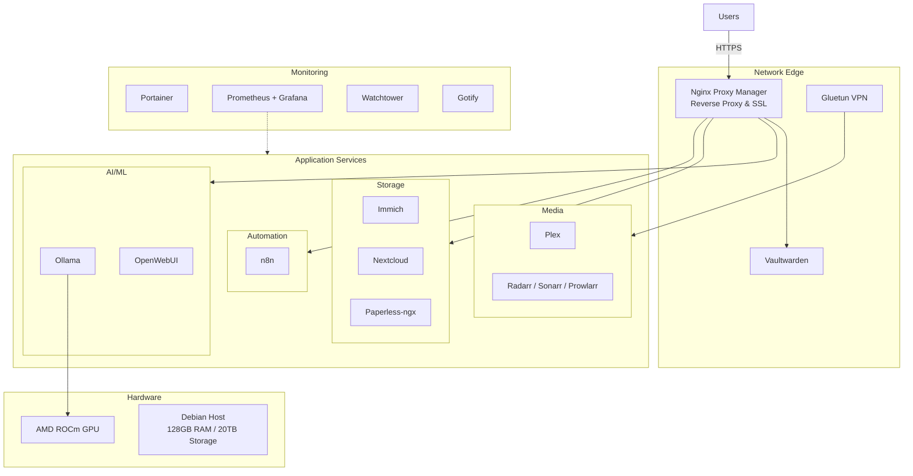

# Homelab

Docker-based home infrastructure running 40+ containers across networking, AI, storage, media, automation, and monitoring stacks on Debian with an AMD ROCm GPU.

## Architecture


```mermaid
graph TB
    USER["Users"]

    subgraph EDGE["Network Edge"]
        NPM["Nginx Proxy Manager<br/>Reverse Proxy & SSL"]
        VPN["Gluetun VPN"]
        VAULT["Vaultwarden"]
    end

    subgraph SERVICES["Application Services"]
        subgraph AI["AI/ML"]
            OLLAMA["Ollama"]
            WEBUI["OpenWebUI"]
        end
        subgraph STORAGE["Storage"]
            IMMICH["Immich"]
            NEXTCLOUD["Nextcloud"]
            PAPERLESS["Paperless-ngx"]
        end
        subgraph MEDIA["Media"]
            PLEX["Plex"]
            ARR["Radarr / Sonarr / Prowlarr"]
        end
        subgraph AUTO["Automation"]
            N8N["n8n"]
        end
    end

    subgraph PLATFORM["Monitoring"]
        PORTAINER["Portainer"]
        PROMETHEUS["Prometheus + Grafana"]
        WATCHTOWER["Watchtower"]
        GOTIFY["Gotify"]
    end

    subgraph INFRA["Hardware"]
        GPU["AMD ROCm GPU"]
        HOST["Debian Host<br/>128GB RAM / 20TB Storage"]
    end

    USER -->|HTTPS| NPM
    NPM --> AI
    NPM --> STORAGE
    NPM --> AUTO
    NPM --> VAULT
    VPN --> MEDIA
    OLLAMA --> GPU
    PROMETHEUS -.-> SERVICES
```

## Services

| Stack | Services | Compose File |
|-------|----------|-------------|
| **Core** | Nginx Proxy Manager, Portainer, Watchtower, Gotify | [`docker-compose.yml`](docker-compose.yml) |
| **AI/ML** | Ollama (GPU), OpenWebUI | [`compose/ai.yml`](compose/ai.yml) |
| **Storage** | Nextcloud, Immich, Paperless-ngx | [`compose/storage.yml`](compose/storage.yml) |
| **Media** | Plex, Radarr, Sonarr, Prowlarr, Gluetun VPN | [`compose/media.yml`](compose/media.yml) |
| **Automation** | n8n, Vaultwarden | [`compose/automation.yml`](compose/automation.yml) |
| **Monitoring** | Prometheus, Grafana | [`compose/monitoring.yml`](compose/monitoring.yml) |

## Quick Start

```bash
git clone https://github.com/psimaker/homelab.git
cd homelab
cp .env.example .env
# Edit .env with your credentials

# Start core infrastructure
docker compose up -d

# Start individual stacks
docker compose -f compose/ai.yml up -d
docker compose -f compose/storage.yml up -d
docker compose -f compose/media.yml up -d
docker compose -f compose/automation.yml up -d
docker compose -f compose/monitoring.yml up -d
```

## Prerequisites

- Docker Engine 24+ and Docker Compose v2
- 32GB+ RAM (128GB recommended for AI workloads)
- AMD GPU with ROCm support (for Ollama)
- A domain with DNS pointing to your server (for SSL)

## Configuration

Copy `.env.example` to `.env` and fill in your values. All secrets (database passwords, API keys, etc.) are loaded from environment variables and never committed.

Key variables:

| Variable | Purpose |
|----------|---------|
| `PUID` / `PGID` | Container user/group IDs |
| `TZ` | Timezone (`Europe/Zurich`) |
| `DOMAIN` | Your domain for reverse proxy |
| `MYSQL_*` | Database credentials for Nextcloud |
| `VPN_*` | VPN provider credentials for Gluetun |

See [`.env.example`](.env.example) for the full list.

## Network Layout

Services are isolated using separate Docker networks:

- **proxy** — public-facing services behind Nginx Proxy Manager
- **internal** — databases and backend services (no external access)
- **vpn** — media services routed through Gluetun
- **monitoring** — Prometheus scrape targets

## License

[MIT](LICENSE)
