# 🏠 Homelab Infrastructure

A comprehensive Docker-based home laboratory infrastructure showcasing modern DevOps practices, container orchestration, and automated deployment.

## 📋 Project Overview

This homelab represents a fully containerized infrastructure with over 40 Docker containers running various services including AI/ML platforms, document management, media servers, monitoring tools, and automation workflows. The setup demonstrates enterprise-grade DevOps practices in a home environment.

## 🏗️ Architecture Diagram

```mermaid

%%{init: {'theme':'dark', 'themeVariables': { 'primaryColor':'#1f2937', 'primaryBorderColor':'#3b82f6', 'primaryTextColor':'#f3f4f6', 'lineColor':'#6366f1', 'secondaryColor':'#374151', 'tertiaryColor':'#1e293b'}}}%%

graph TB
    %% ---------- Professional Homelab Infrastructure ----------
    
    USER["👤 <b>Users & Clients</b><br/><i>Multi-Platform Access</i>"]
    
    subgraph EDGE["🛡️ Network Edge & Security Layer"]
        NPM["📡 <b>Nginx Proxy Manager</b><br/><i>Reverse Proxy & SSL</i><br/>• Let's Encrypt<br/>• Access Control<br/>• Rate Limiting"]
        VPN["🔐 <b>Gluetun VPN</b><br/><i>Container VPN Client</i><br/>• Multi-Provider<br/>• Kill Switch<br/>• Port Forwarding"]
        VAULTWARDEN["🔑 <b>Vaultwarden</b><br/><i>Password Manager</i>"]
    end

    subgraph SERVICES["⚡ Application Services - 40+ Containers"]
        subgraph AI["🤖 AI/ML Platform"]
            OLLAMA["<b>Ollama</b><br/><i>LLM Engine</i><br/>• Llama 3 70B<br/>• DeepSeek R1<br/>• GPU Accelerated"]
            OPENWEBUI["<b>OpenWebUI</b><br/><i>ChatGPT Alternative</i><br/>• Edge-TTS German<br/>• Apache Tika"]
        end

        subgraph STORAGE["💾 Storage & Cloud"]
            IMMICH["<b>Immich</b><br/><i>Google Photos Alt</i><br/>• ML Photo Analysis<br/>• Face Recognition"]
            NEXTCLOUD["<b>Nextcloud</b><br/><i>Private Cloud</i><br/>• File Sync<br/>• Collaboration"]
        end

        subgraph MEDIA["🎬 Media Stack"]
            PLEX["<b>Plex</b><br/><i>Media Server</i><br/>• Transcoding<br/>• Multi-Device"]
            ARR["<b>*arr Stack</b><br/><i>Media Automation</i><br/>• Radarr/Sonarr<br/>• Prowlarr"]
        end

        subgraph AUTO["⚙️ Automation"]
            N8N["<b>n8n</b><br/><i>Workflow Engine</i><br/>• 350+ Integrations<br/>• AI Agents"]
            PAPERLESS["<b>Paperless-ngx</b><br/><i>Document Mgmt</i><br/>• OCR Processing<br/>• Paperless-AI"]
        end
    end

    subgraph PLATFORM["📊 Platform & Monitoring"]
        PORTAINER["<b>Portainer CE</b><br/><i>Container Management</i><br/>• Stack Deployment<br/>• Resource Monitoring"]
        PROMETHEUS["<b>Prometheus</b><br/><i>Metrics & Alerting</i><br/>• Service Health<br/>• Performance Data"]
        WATCHTOWER["<b>Watchtower</b><br/><i>Auto Updates</i>"]
        GOTIFY["<b>Gotify</b><br/><i>Push Notifications</i>"]
    end

    subgraph INFRA["🖥️ Infrastructure Foundation"]
        subgraph DOCKER["🐳 Container Platform"]
            COMPOSE["<b>Docker Compose</b><br/><i>Orchestration</i>"]
            ENGINE["<b>Docker Engine</b><br/><i>Container Runtime</i>"]
        end
        subgraph HARDWARE["⚡ Hardware Layer"]
            GPU["🎮 <b>AMD ROCm GPU</b><br/><i>AI Acceleration</i><br/>• 8GB+ VRAM"]
            HOST["💻 <b>Host System</b><br/><i>Proxmox/Ubuntu</i><br/>• 32GB+ RAM<br/>• 100GB+ Storage"]
        end
    end

    %% Main Connections
    USER ==>|"HTTPS/443"| NPM
    NPM -->|"Proxy Routes"| AI
    NPM -->|"Proxy Routes"| STORAGE
    NPM -->|"Proxy Routes"| AUTO
    NPM -->|"Proxy Routes"| PLATFORM
    NPM -->|"Proxy Routes"| VAULTWARDEN
    
    %% VPN for Media Stack
    VPN -.->|"Encrypted Tunnel"| MEDIA
    
    %% AI GPU Acceleration
    OLLAMA ==>|"ROCm Driver"| GPU
    
    %% Monitoring Connections
    PROMETHEUS -.->|"Scrape Metrics"| AI
    PROMETHEUS -.->|"Scrape Metrics"| STORAGE
    PROMETHEUS -.->|"Scrape Metrics"| MEDIA
    PROMETHEUS -.->|"Scrape Metrics"| AUTO
    
    %% Platform Management
    PORTAINER ==>|"Manages"| COMPOSE
    WATCHTOWER -.->|"Updates"| ENGINE
    GOTIFY -.->|"Alerts"| PROMETHEUS
    
    %% Infrastructure
    COMPOSE ==>|"Runs on"| ENGINE
    ENGINE ==>|"Runs on"| HOST
    GPU -.->|"PCIe Passthrough"| HOST

    %% Styling
    classDef userStyle fill:#0f172a,stroke:#ef4444,stroke-width:3px,color:#ffffff,font-weight:bold
    classDef edgeStyle fill:#1e293b,stroke:#3b82f6,stroke-width:2px,color:#e0e7ff
    classDef aiStyle fill:#312e81,stroke:#8b5cf6,stroke-width:2px,color:#ede9fe
    classDef storageStyle fill:#1e3a5f,stroke:#0ea5e9,stroke-width:2px,color:#e0f2fe
    classDef mediaStyle fill:#581c87,stroke:#d946ef,stroke-width:2px,color:#fae8ff
    classDef autoStyle fill:#134e4a,stroke:#14b8a6,stroke-width:2px,color:#ccfbf1
    classDef monStyle fill:#713f12,stroke:#f59e0b,stroke-width:2px,color:#fef3c7
    classDef infraStyle fill:#111827,stroke:#10b981,stroke-width:2px,color:#d1fae5
    classDef gpuStyle fill:#7c2d12,stroke:#fb923c,stroke-width:2px,color:#fed7aa
    
    class USER userStyle
    class NPM,VPN,VAULTWARDEN edgeStyle
    class OLLAMA,OPENWEBUI aiStyle
    class IMMICH,NEXTCLOUD storageStyle
    class PLEX,ARR mediaStyle
    class N8N,PAPERLESS autoStyle
    class PORTAINER,PROMETHEUS,WATCHTOWER,GOTIFY monStyle
    class COMPOSE,ENGINE,HOST infraStyle
    class GPU gpuStyle


```



## 🛠️ Tech Stack

### Containerization & Orchestration
- **Docker** - Container runtime
- **Docker Compose** - Container orchestration
- **Portainer** - Container management UI
- **Watchtower** - Automatic container updates

### Networking & Security
- **Nginx Proxy Manager** - Reverse proxy with SSL
- **Gluetun VPN** - Secure container networking
- **Vaultwarden** - Password manager

### AI & Machine Learning
- **Ollama** - Large Language Model framework
- **OpenWebUI** - Web interface for LLMs
- **Immich Machine Learning** - Photo analysis AI

### Storage & Media
- **Immich** - Google Photos alternative
- **Plex** - Media server
- **Nextcloud** - File sharing & collaboration
- **Paperless-ngx** - Document management
- **Paperless-AI** - AI-powered document processing

### Automation & Monitoring
- **n8n** - Workflow automation
- **Prometheus** - Monitoring & alerting
- **Gotify** - Push notifications

## 🤖 AI & Machine Learning Stack

### Ollama + OpenWebUI - Modern AI Infrastructure

This homelab features a cutting-edge AI stack with **Ollama** for local LLM inference and **OpenWebUI** as a professional ChatGPT alternative. This combination represents the forefront of self-hosted AI infrastructure and is currently at the center of the AI narrative.

#### 🎯 Why This Matters for DevOps/SRE Roles:
- **Enterprise AI Readiness**: Demonstrates ability to deploy and manage production AI infrastructure
- **GPU Optimization**: AMD ROCm integration shows hardware acceleration expertise
- **Scalable AI Services**: Containerized approach allows horizontal scaling of AI workloads
- **Monitoring Integration**: AI services integrated with Prometheus monitoring stack

#### Key Features:
- **Local LLM Inference**: Run models like Llama 3 (70B), Mistral (8x22B), and CodeLlama locally
- **Enterprise Web Interface**: Production-grade web UI comparable to ChatGPT Plus
- **Multi-Model Orchestration**: Dynamic model loading and switching capabilities
- **Voice Integration**: Edge-TTS with German language support for text-to-speech
- **Document Intelligence**: Apache Tika for advanced document processing and analysis
- **GPU Acceleration**: Full AMD ROCm support with hardware optimization

#### Architecture:

```mermaid
%% ------------- AI Stack Detail -------------

graph TB

    User([👤 User Request])

    subgraph FRONT["🔓 Frontend Layer"]
        NPM[Nginx Proxy Manager]
        OpenWebUI[OpenWebUI Interface]
    end

    subgraph BACK["⚙️ Backend Layer"]
        Ollama[Ollama LLM Engine]
        EdgeTTS[Edge-TTS German]
        Tika[Apache Tika]
    end

    subgraph ACCEL["🚀 Acceleration"]
        GPU[AMD ROCm GPU]
    end

    subgraph METRICS["📈 Observability"]
        Prometheus[Prometheus]
    end

    User --> NPM --> OpenWebUI
    OpenWebUI --> Ollama
    OpenWebUI --> EdgeTTS
    OpenWebUI --> Tika

    Ollama -.->|"GPU<br>Acceleration"| GPU

    Prometheus -.->|"Metrics"| OpenWebUI
    Prometheus -.->|"Metrics"| Ollama
    Prometheus -.->|"Metrics"| EdgeTTS

    %% --- styling ---
    classDef default   fill:#0d1117,stroke:#58a6ff,stroke-width:2px,color:#c9d1d9
    classDef user      fill:#21262d,stroke:#f85149,stroke-width:2px,color:#fff
    classDef proxy     fill:#161b22,stroke:#3fb950,stroke-width:2px,color:#c9d1d9
    classDef service   fill:#161b22,stroke:#a371f7,stroke-width:2px,color:#c9d1d9
    classDef gpu       fill:#161b22,stroke:#d29922,stroke-width:2px,color:#c9d1d9
    classDef metrics   fill:#161b22,stroke:#ff7b72,stroke-width:2px,color:#c9d1d9

    class User user
    class NPM proxy
    class OpenWebUI,Ollama,EdgeTTS,Tika service
    class GPU gpu
    class Prometheus metrics
```



#### Performance Optimization:
- **GPU Acceleration**: AMD ROCm support with dedicated GPU memory allocation
- **Memory Management**: 8GB+ VRAM allocation for large language models
- **Model Persistence**: OLLAMA_KEEP_ALIVE=-1 prevents costly model reloading
- **Flash Attention**: Optimized attention mechanisms for 2x inference speed
- **Health Monitoring**: Comprehensive health checks and metrics collection

#### Model Management:
```bash
# Pull and run state-of-the-art models
docker exec -it ollama ollama pull gpt-oss:20b # JSON parsing issues
docker exec -it ollama ollama pull deepseek-r1:70b
docker exec -it ollama ollama pull deepseek-coder:33b

# Monitor model performance
docker exec -it ollama ollama ps
docker logs ollama --tail=50

# API access for integration
curl http://localhost:11434/api/generate -d '{
  "model": "gpt-oss:20b",
  "prompt": "Explain DevOps best practices",
  "stream": false
}'
```

### Quick AI Stack Deployment

```bash
# Start AI services with GPU support
cd ai-stack
docker-compose up -d

# Verify GPU acceleration
docker exec -it ollama ollama run gpt-oss:20b "Hello" --verbose

# Access interfaces:
# OpenWebUI: https://ai.your-domain.com
# Ollama API: http://localhost:11434
# Metrics: http://localhost:9090 (Prometheus)
```

## 🚀 Quick Start

### Prerequisites
- Docker Engine 20.10+
- Docker Compose 2.0+
- 32GB+ RAM recommended
- a lot of VRAM :)
- 100GB+ storage

### Installation

1. **Clone the repository**
   ```bash
   git clone https://github.com/psimaker/homelab.git
   cd homelab
   ```

2. **Set up environment variables**
   ```bash
   cp .env.example .env
   # Edit .env with your configuration
   ```

3. **Start the infrastructure**
   ```bash
   # Start all services
   docker-compose up -d
   
   # Or start specific stacks
   docker-compose -f ai-stack.yml up -d
   docker-compose -f media-stack.yml up -d
   ```

### Access Points

- **Portainer**: http://localhost:9000
- **Nginx Proxy Manager**: http://localhost:81
- **Immich**: http://immich.your-domain.com
- **Nextcloud**: http://nextcloud.your-domain.com
- **OpenWebUI**: http://ai.your-domain.com

## 📁 Project Structure

```
homelab/
├── ai-stack/                 # AI & Machine Learning services
│   ├── ollama/
│   ├── openwebui/
│   └── docker-compose.yml
├── media-stack/              # Media services
│   ├── immich/
│   ├── plex/
│   └── docker-compose.yml
├── automation-stack/         # Automation tools
│   ├── n8n/
│   ├── paperless/
│   └── docker-compose.yml
├── monitoring-stack/         # Monitoring & management
│   ├── portainer/
│   ├── prometheus/
│   └── docker-compose.yml
├── .env.example              # Environment template
├── docker-compose.yml        # Main composition
└── README.md
```

## 🔧 Configuration

### Environment Variables
Key environment variables to configure:

```bash
# Docker user/group IDs
PUID=1000
PGID=1000

# Timezone
TZ=Europe/Zurich

# Database credentials
MYSQL_ROOT_PASSWORD=secure_password
MYSQL_DATABASE=nextcloud
MYSQL_USER=nextcloud
MYSQL_PASSWORD=db_password

# Domain configuration
DOMAIN=your-domain.com
```

### Network Setup
The infrastructure uses multiple Docker networks for security isolation:
- **Internal networks** for database and backend services
- **External networks** for public-facing services
- **VPN network** for secure external access

## 📊 Monitoring & Logging

- **Prometheus** for metrics collection
- **Portainer** for container monitoring
- **Docker logs** with log rotation
- **Health checks** for all critical services

## 🔒 Security Features

- SSL encryption via Let's Encrypt
- Network segmentation and isolation
- Regular security updates via Watchtower
- Environment variables for sensitive data
- VPN integration for secure access


## 🗺️ Roadmap

- **Experimenting with Freqtrade and ML**  
    Backtesting, hyperparameter tuning, and risk controls in Docker; metrics export for strategy health.
    
- **n8n projects with complex AI agents**  
    Tool-using chains, retrieval-augmented generation, and guarded actions (rate limits, safe-ops).
    
- **Mac Studio LLM cluster (near-term)**  
    Build a cluster of multiple **Mac Studios** and use **Kubernetes** to serve **large LLMs**.
    
- **Backup/restore drills**  
    Regular test restores for Immich, Nextcloud, and Paperless with short runbooks.


## 🚦 Status

**Active Development** - This homelab is continuously improved with new services and optimizations. All core services are production-ready and stable.


## 📞 Contact

- **GitHub**: [psimaker](https://github.com/psimaker)
- **LinkedIn**: https://www.linkedin.com/in/umut-erdem
- **Email**: umut.erdem@protonmail.com

## 📄 License

This project is licensed under the MIT License - see the [LICENSE](LICENSE) file for details.

---

*Built with ❤️ using Docker.*
