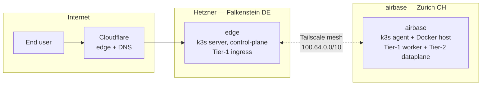
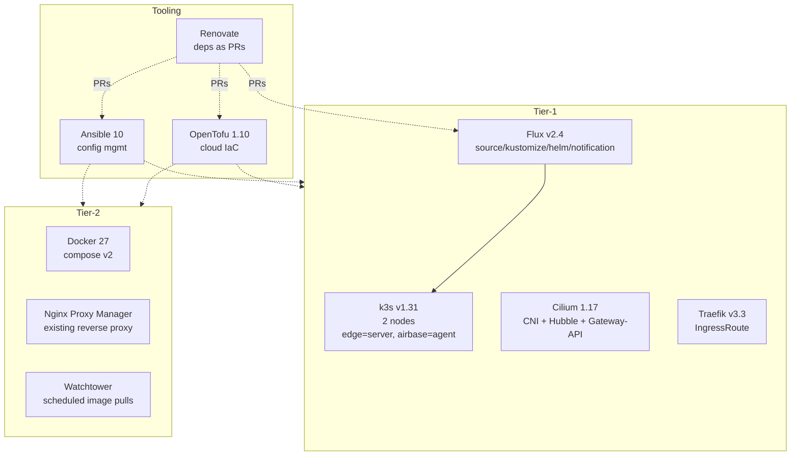

# Architecture

This document is the canonical design reference for the homelab repository.
It is written for two audiences: a future-me debugging at 2 AM, and a reviewer
who wants to understand the whole picture in fifteen minutes.

> If a directory has its own `README.md`, it explains *how that directory is
> used*. This document explains *what the system is and why*.

## TL;DR

A two-tier home infrastructure that hosts [loogi.ch](https://loogi.ch) — a
public SearXNG-based search engine — and a constellation of personal
self-hosted services. Tier-1 is a Kubernetes (k3s) platform spanning a
Hetzner Cloud node and the home server, fully managed via GitOps. Tier-2 is
the existing Docker Compose dataplane on the home server, deliberately left
in place because TBs of media and stateful workloads do not benefit from
being replatformed.



## Table of contents

1. [Tiers and what runs where](#tiers-and-what-runs-where)
2. [Hardware and topology](#hardware-and-topology)
3. [Network and identity](#network-and-identity)
4. [Substrate and orchestration](#substrate-and-orchestration)
5. [GitOps, CI, dependency management](#gitops-ci-dependency-management)
6. [Secrets](#secrets)
7. [TLS and reverse proxy](#tls-and-reverse-proxy)
8. [Observability](#observability)
9. [Backups](#backups)
10. [Domain and namespace conventions](#domain-and-namespace-conventions)
11. [Versioning and pinning policy](#versioning-and-pinning-policy)
12. [Bootstrap sequence](#bootstrap-sequence)
13. [Day-2 operations](#day-2-operations)

---

## Tiers and what runs where

The deliberate split between Tier-1 (Kubernetes) and Tier-2 (Docker Compose
on bare-metal Debian) is the most important decision in this repository.
See [`docs/adr/0001-tier1-tier2-split.md`](adr/0001-tier1-tier2-split.md) for
the long-form rationale.

### Tier-1 — Platform

Kubernetes (k3s) cluster. New workloads land here. Reconciled by Flux from
this repository. Stateful workloads in this tier use Longhorn volumes with
restic-based offsite snapshots.

Workloads:

| Workload                | Public domain                 | Why it lives here                      |
| ----------------------- | ----------------------------- | -------------------------------------- |
| LOOGI (SearXNG)         | loogi.ch                      | Stateless web app, horizontally scalable, public SLO target |
| Pocket-ID               | id.psimaker.org               | OIDC IdP for new admin services         |
| Tinyauth                | (cluster-internal)            | Forward-auth proxy for non-OIDC tools   |
| Headscale               | hs.psimaker.org               | Tailscale control-plane (own keys)      |
| kube-prometheus-stack   | (internal-only via Tailscale) | Cluster + node metrics, alerts          |
| Loki                    | (internal-only via Tailscale) | Log aggregation                         |
| Tempo                   | (internal-only via Tailscale) | Trace storage (Day-2 OTel readiness)    |
| Beszel                  | (internal-only via Tailscale) | Lightweight uptime + node metrics       |
| Grafana                 | (internal-only via Tailscale) | Dashboards, OIDC via Pocket-ID         |
| External-Secrets Op.    | n/a                           | Future-proofing for non-SOPS sources    |
| cloudflared             | n/a                           | Cloudflare Tunnel daemon                |
| Renovate                | n/a                           | Dependency updates as PRs              |

### Tier-2 — Dataplane

Docker Compose on `airbase`, bare-metal Debian. ~50 containers, gigabytes to
terabytes of state, longstanding setup. Ansible manages the *host* (kernel
sysctls, fail2ban, node_exporter, restic timer). Compose files live in
[`compose/`](../compose/) as 1:1 snapshots — they are the source of truth
for those services.

Workloads (selection):

| Stack            | Purpose                          | Public domain                  |
| ---------------- | -------------------------------- | ------------------------------ |
| Plex             | Personal media library           | (LAN + Tailscale only)         |
| *arr / sabnzbd   | Media automation behind Gluetun  | (LAN + Tailscale only)         |
| Nextcloud-AIO    | Files, calendars, contacts       | nextcloud.psimaker.org         |
| Immich           | Photo library, CUDA-accelerated  | photos.psimaker.org            |
| Paperless-ngx    | Document archive                 | docs.psimaker.org              |
| Vaultwarden      | Password manager                 | bitwarden.psimaker.org         |
| Gitea + runner   | Self-hosted Git + CI             | git.psimaker.org               |
| n8n              | Workflow automation              | n8n.psimaker.org               |
| Syncthing        | File sync (incl. VaultSync iOS)  | syncthing.psimaker.org         |
| ntfy             | Push notifications               | ntfy.psimaker.org              |
| crawl4ai         | Headless web extraction          | (cluster-internal + LOOGI)     |
| xbrowsersync     | Browser bookmark sync            | bookmarks.psimaker.org         |
| Grimmory         | Self-hosted books library        | library.psimaker.org           |
| Arcane           | Docker management UI             | arcane.psimaker.org            |
| watchtower       | Image-pull on labelled containers | n/a                           |

> Anything that needs to be portable, scaled out, or rebuilt from zero in
> minutes belongs in Tier-1. Anything that owns terabytes of state or has
> survived multiple Docker upgrades stays in Tier-2.

---

## Hardware and topology

Two physical sites, one logical platform.

### `airbase` — home (CH)

| | |
| --- | --- |
| Form factor | tower workstation |
| CPU         | 16-core / 32-thread (server-grade x86_64) |
| RAM         | 64 GB ECC |
| Storage     | 4 TB NVMe (system + container data) + 16 TB HDD (`/mnt/hdd` for media) |
| OS          | Debian 12 (bookworm), kernel 6.1 |
| Roles       | Tier-2 Docker host **and** Tier-1 k3s agent |
| Network     | 1 GbE to home router (`192.168.8.112/24`), no public IPv4 ingress |
| Power       | Behind a CyberPower CP1500 UPS, monitored via NUT |

Why airbase is also a k3s agent:

- GPU access (Immich ML uses CUDA today; LLM workloads in Tier-1 can use the
  same GPU via NVIDIA device-plugin)
- Higher-RAM workloads cheaper on owned hardware than on Hetzner
- Failure-domain diversity: a Hetzner outage does not take down everything

### `edge` — Hetzner Cloud (Falkenstein, DE)

| | |
| --- | --- |
| Provider    | Hetzner Cloud |
| Server      | CX22 — 2 vCPU AMD shared, 4 GB RAM, 40 GB SSD |
| Region      | Falkenstein, DE (`fsn1`) |
| OS          | Debian 12 minimal, cloud-init bootstrapped |
| Roles       | k3s server (control-plane), Tier-1 ingress, Cloudflare Tunnel daemon |
| Network     | Public IPv4 + IPv6, attached to Hetzner private network |
| Cost        | ≈ €4.51 / month |

Why edge holds the control plane: it has stable public reachability, no NAT,
and the API server endpoint can live on its Tailscale interface — kubectl
from anywhere, no port-forwarding at home.

### Off-cluster storage

| | |
| --- | --- |
| Hetzner Object Storage | OpenTofu state, S3-compatible, EU data residency |
| Hetzner Storage Box BX11 | Restic offsite #1, 1 TB, ≈ €3.20 / month |
| Backblaze B2          | Restic offsite #2 for critical sets only, ≈ $1.50 / month |

---

## Network and identity

### Mesh: Tailscale + Headscale

Inter-node connectivity is a Tailscale mesh. The control plane is a
self-hosted **Headscale** instance running on the cluster (`hs.psimaker.org`).

This means there is **one** identity domain for nodes, operator devices
(laptop, phone), and even individual workloads via the Tailscale Operator if
needed later. ACLs live as code in
[`kubernetes/infrastructure/identity/headscale/acl.hujson`](../kubernetes/infrastructure/identity/headscale/acl.hujson).

Tailnet IPs:

| Node    | Tailnet IP  | Hostname            |
| ------- | ----------- | ------------------- |
| edge    | 100.64.0.1  | `edge.tailnet`      |
| airbase | 100.64.0.2  | `airbase.tailnet`   |
| laptop  | 100.64.0.10 | `umo-laptop.tailnet`|
| phone   | 100.64.0.11 | `umo-phone.tailnet` |

> See [`docs/adr/0012-headscale-vs-vanilla-wireguard.md`](adr/0012-headscale-vs-vanilla-wireguard.md).

### Ingress: Cloudflare Tunnel

Inbound public traffic for Tier-1 services flows through a Cloudflare Tunnel
that terminates at the cloudflared pod in the edge node, which forwards to
Traefik via a ClusterIP service. **No port forwarding** anywhere; airbase
has no inbound from the internet.

For Tier-2 services on `airbase`, the existing Nginx Proxy Manager remains
the public ingress with Let's Encrypt certificates issued via NPM. The
two-issuer split is documented in
[`docs/adr/0005-tls-zwei-issuer.md`](adr/0005-tls-zwei-issuer.md).

### Internal DNS

Today the home network uses the ISP router's resolver, with Tailscale's
MagicDNS providing tailnet-host name resolution. **AdGuard Home is planned**
as a Tier-2 Compose service to add ad-blocking and split-horizon resolution
for `*.loogi.ch` and `*.psimaker.org` (so internal traffic skips the
Cloudflare round-trip). See [`compose/adguard/`](../compose/adguard/) for
the prepared compose definition.

---

## Substrate and orchestration



### k3s configuration

- One server on `edge`, one agent on `airbase`.
- CNI: **Cilium** (replaces default flannel). kube-proxy is kept; Cilium runs
  in chaining-friendly mode. Hubble UI is exposed only on the tailnet.
  See [`docs/adr/0011-cilium-as-cni.md`](adr/0011-cilium-as-cni.md).
- Built-ins disabled at install: `traefik`, `servicelb`, `metrics-server`.
  We install our own. Reason: Renovate-tracked Helm releases beat
  baked-in versions.
- API-server `--advertise-address` and `--node-ip` use the Tailscale
  interface. The kubeconfig embeds the tailnet hostname, never the public IP.
- `kube-vip` in ARP mode handles the rare LoadBalancer IP for things that
  must speak L4 outside Traefik (e.g. the Cloudflare Tunnel ClusterIP).

### Container runtime on airbase

Docker keeps running as before. k3s installs its own containerd alongside;
the two do not interfere as long as workloads don't share host networking
on conflicting ports. We pinned k3s containerd to `--snapshotter=overlayfs`
to match Docker.

---

## GitOps, CI, dependency management

### The repository pair

```
PRIMARY (where commits land, where CI runs):
  git.psimaker.org/umut.erdem/homelab     (Gitea, private)

PUBLIC MIRROR (recruiter-facing, read-only):
  github.com/psimaker/homelab             (force-pushed from CI on every push)

LOOGI (separate repo with its own ADRs):
  git.psimaker.org/umut.erdem/loogi  →  github.com/psimaker/loogi
```

Pushing to Gitea triggers the `mirror-github.yml` workflow, which mirrors
`refs/heads/main` and tags. Direct pushes to GitHub from a developer machine
are not used.

### Flux topology

Flux is bootstrapped against this repo with the path `kubernetes/`. The
`flux-system` Kustomization aggregates two child Kustomizations:

```
flux-system
├── infrastructure   (path: kubernetes/infrastructure)
└── apps             (path: kubernetes/apps, depends on: infrastructure)
```

Sync intervals:

- `infrastructure` Kustomization: 10 minutes (controllers change rarely)
- `apps` Kustomization: 1 minute (workloads iterate fast)
- HelmReleases inherit a 5-minute reconcile by default

Flux uses **SOPS decryption** (age) to materialise Secret manifests at apply
time. The decryption key is stored in the cluster as
`Secret/sops-age` in namespace `flux-system`, populated once at bootstrap.

### Gitea Actions workflows

Located in [`.gitea/workflows/`](../.gitea/workflows/). All run on a
self-hosted runner (`gitea-runner` on airbase). GitHub mirrors run the same
workflows in `.github/workflows/` only as no-ops that pass — the source of
truth is Gitea.

| Workflow              | Trigger                | What it does |
| --------------------- | ---------------------- | ------------ |
| `lint.yml`            | PR + push              | yamllint, ansible-lint, tflint, kubeconform, gitleaks, sops-encryption-check |
| `tofu-plan.yml`       | PR touching `terraform/` | `tofu init && tofu plan`, posts diff as PR comment |
| `tofu-apply.yml`      | merge → main           | `tofu apply -auto-approve`, with manual gate for destructive plans |
| `ansible-check.yml`   | PR touching `ansible/` | `ansible-playbook --check --diff` over the tailnet |
| `ansible-apply.yml`   | merge → main           | `ansible-playbook` against airbase + edge |
| `mirror-github.yml`   | push → main            | `git push --mirror` to GitHub |
| `restore-test.yml`    | weekly + manual        | runs `scripts/restic-restore-test.sh`, fails the build on diff |

### Renovate

Self-hosted, runs as a CronJob in k3s. Configured by
[`renovate.json5`](../renovate.json5). Schedule:
`before 6am on monday` and `before 6am on thursday`, Europe/Zurich.

Auto-merge policy:

- **Auto-merge** patch + minor of trusted ecosystem images (Flux, Cilium,
  Traefik, Prometheus, Grafana, External-Secrets, cloudflared)
- **Manual review** for major bumps, k3s/Talos any change, Cloudflare
  Terraform provider, anything tagged `needs-adr`
- **Pin SearXNG by digest** so an upstream tag move never breaks LOOGI's
  `Dockerfile` patches

---

## Secrets

Single mechanism: **SOPS + age**, encrypted at rest in the public mirror,
decrypted in three places:

1. Operator's machine via `~/.config/sops/age/keys.txt` (private key)
2. Inside the cluster via `Secret/sops-age` in `flux-system` namespace
3. CI runners via `SOPS_AGE_KEY` secret (for `ansible-apply` etc.)

The two age recipients are anchored in [`.sops.yaml`](../.sops.yaml). To add
a new operator (or rotate), run `sops updatekeys` over every encrypted file.

Why not Vault: see [`docs/adr/0004-secrets-sops-vs-vault.md`](adr/0004-secrets-sops-vs-vault.md).
Short version — Vault is the right answer when you have humans with
heterogeneous access; here there is one human and one cluster, and the audit
trail in `git log` is sufficient.

External-Secrets Operator is installed but used sparingly: only for
secrets that genuinely need to live elsewhere (e.g. Cloudflare API token
mirrored from a 1Password store) — that gives a defensible upgrade path if
Vault becomes appropriate later.

Plaintext-prevention layers:

1. `.gitignore` blocks `*.env`, `*.key`, `*.pem`, decrypted SOPS files
2. `pre-commit` runs `gitleaks` and `forbid-secrets`
3. CI re-runs the same on every PR
4. Code review gate on the human side

---

## TLS and reverse proxy

Two issuers, deliberate:

| | Tier-1 (k3s) | Tier-2 (Compose) |
| --- | --- | --- |
| Reverse proxy | Traefik v3.3 | Nginx Proxy Manager |
| TLS issuer    | cert-manager + Let's Encrypt DNS-01 (Cloudflare) | NPM's built-in ACME (HTTP-01 via NPM) |
| Wildcards     | `*.loogi.ch`, `*.psimaker.org` (Tier-1 sub-zone) | per-host certs |
| Enforcement   | TLS 1.2+ via Traefik default; HSTS via middleware | Force-SSL + HSTS toggle in NPM |

Long-form rationale: [`docs/adr/0005-tls-zwei-issuer.md`](adr/0005-tls-zwei-issuer.md).

---

## Observability

### What we collect

- **Metrics:** kube-prometheus-stack (Prometheus, Alertmanager, Grafana,
  node-exporter, kube-state-metrics, prometheus-operator). Scrape interval
  30s standard, 10s for SLO-critical targets.
- **Logs:** Loki in simple-scalable mode. Promtail as DaemonSet on Tier-1;
  Docker `loki` log-driver on airbase pushes directly to Loki via the
  tailnet endpoint.
- **Traces:** Tempo with OTLP receiver. Day-1 we have very few sources;
  this is here so the next service that gets instrumented has somewhere to
  send to.
- **Uptime + node side-channel:** Beszel agents on every node. Lightweight,
  push-based, gives a "is it alive?" signal without scraping.

### Cross-tier scraping

Prometheus on edge scrapes airbase via the Tailscale interface
(`100.64.0.2:9100`, `:9101`, `:9090`-style). Promtail on airbase pushes to
`http://loki.observability.svc.cluster.local:3100` via the tailnet. There
is no public observability surface — see
[`docs/adr/0009-internal-only-observability.md`](adr/0009-internal-only-observability.md).

### Alerting

Alertmanager routes:

- `severity: critical` → ntfy `https://ntfy.psimaker.org/homelab-critical`
  (plus phone push)
- `severity: warning`  → ntfy `https://ntfy.psimaker.org/homelab-warnings`
  (digest, not paging)
- `severity: info`     → silenced unless triaging

Every alert has a `runbook_url` annotation pointing into [`docs/runbooks/`](runbooks/).

### SLOs

LOOGI is the SLO pilot. Sloth-format SLOs in
[`kubernetes/apps/loogi/slos.yaml`](../kubernetes/apps/loogi/slos.yaml)
generate multi-window multi-burn-rate alerts (Google SRE pattern).

Targets:

- `loogi-availability`: 99.5% over 28-day rolling window
- `loogi-latency-p95`:  ≥ 95% of `/search` requests < 800ms

---

## Backups

3-2-1, tested.

```
Production data
  ├─ snapshot (local)
  │    ├─ Tier-1: Longhorn snapshot every 6h, retained 24h × 14
  │    └─ Tier-2: nothing extra; restic relies on at-rest copy
  ├─ offsite #1 — Hetzner Storage Box (encrypted with restic)
  │    Retention: 14 daily / 8 weekly / 6 monthly
  └─ offsite #2 — Backblaze B2 (encrypted with restic, critical sets only)
       Retention: 6 monthly / 2 yearly
```

What's "critical sets" for the B2 tier:
- LOOGI configuration + ADRs (the loogi repo itself is on Gitea + GitHub
  mirror, but operational state worth preserving)
- Vaultwarden database
- Paperless documents
- Nextcloud database snapshot (not file blobs — those live on Hetzner only)
- Gitea database + repo bundles

Restore tests run weekly via `scripts/restic-restore-test.sh`, exercised by
the `restore-test.yml` workflow. The script picks one repo at random,
restores into a temp directory, diffs against a known-good fixture, and
fails the workflow on mismatch. Last 8 weeks of results are kept as workflow
artefacts.

See [`docs/adr/0007-backup-restic-3-2-1.md`](adr/0007-backup-restic-3-2-1.md).

---

## Domain and namespace conventions

### Domains

- **`loogi.ch`** — production search engine and its first-party services
  (`grafana-public.loogi.ch` is **not** used; observability is internal-only)
- **`psimaker.org`** — personal infrastructure
  - Tier-2 services use existing subdomains (e.g. `bitwarden.psimaker.org`)
  - Tier-1 platform uses new subdomains (`id.psimaker.org`, `hs.psimaker.org`)
- **`*.tailnet` (MagicDNS)** — internal-only services (Grafana, Beszel,
  Headscale admin, Hubble UI)

### Kubernetes namespaces

| Namespace        | Contents                                                              |
| ---------------- | --------------------------------------------------------------------- |
| `flux-system`    | Flux controllers, sops-age secret                                     |
| `cert-manager`   | cert-manager CRDs and issuer                                          |
| `traefik`        | Traefik IngressRoute controller                                       |
| `kube-system`    | k3s built-ins, Cilium                                                 |
| `external-secrets` | External-Secrets Operator                                           |
| `cloudflared`    | Cloudflare Tunnel daemon                                              |
| `longhorn-system`| Longhorn storage                                                      |
| `observability`  | kube-prometheus-stack, Loki, Tempo, Beszel                            |
| `identity`       | Pocket-ID, Tinyauth, Headscale                                        |
| `loogi`          | LOOGI search engine                                                   |
| `renovate`       | Renovate CronJob                                                      |

---

## Versioning and pinning policy

- All Helm charts pinned to a specific version in their `HelmRelease`.
- All container images pinned to a specific tag (and digest where Renovate
  supports it). SearXNG is pinned by digest because LOOGI's Dockerfile
  patches a specific upstream behaviour.
- OpenTofu providers pinned in `terraform/.terraform.lock.hcl`.
- k3s pinned by Ansible variable (`k3s_version`) — manual bumps only.
- Renovate opens PRs for everything above; auto-merge only as configured.

Currently pinned versions (May 2026):

```
k3s                         v1.31.4+k3s1
cilium                      1.17.0
traefik                     v3.3.0       (chart 33.2.0)
cert-manager                v1.16.2      (chart v1.16.2)
flux                        v2.4.0
external-secrets            v0.10.4      (chart 0.10.4)
kube-prometheus-stack       chart 65.5.0
loki                        chart 6.18.0
tempo                       chart 1.10.1
longhorn                    chart 1.7.2
beszel                      0.10.x
pocket-id                   v0.39.x
tinyauth                    v3.0.x
cloudflared                 2024.12.2
renovate                    ghcr.io/renovatebot/renovate:38
```

Stale-version-detection: PrometheusRule in
[`kubernetes/infrastructure/observability/version-staleness/`](../kubernetes/infrastructure/observability/version-staleness/)
fires a warning if a HelmRelease is more than 6 months behind the
chart's latest tag.

---

## Bootstrap sequence

From an empty Hetzner project to a reconciling cluster, in seven steps.
Every step is automated by `scripts/bootstrap.sh`; the steps are listed for
documentation.

1. **Generate age key** if missing:
   ```
   age-keygen -o ~/.config/sops/age/keys.txt
   ```
2. **OpenTofu provisions cloud:** Hetzner CX22 + Hetzner Object Storage
   bucket + Cloudflare DNS records + Backblaze B2 buckets.
   ```
   cd terraform/live/prod && tofu init && tofu apply
   ```
3. **Ansible bootstraps both nodes:** baseline hardening, Tailscale,
   Docker on airbase (no-op if present), k3s install (server on edge,
   agent on airbase).
   ```
   cd ansible && ansible-playbook playbooks/site.yml
   ```
4. **Bootstrap Flux** with sops-age secret pre-installed:
   ```
   kubectl create namespace flux-system
   kubectl create secret generic sops-age --namespace=flux-system \
     --from-file=age.agekey=$HOME/.config/sops/age/keys.txt
   flux bootstrap gitea \
     --hostname=git.psimaker.org \
     --owner=umut.erdem --repository=homelab \
     --path=kubernetes \
     --branch=main
   ```
5. **Wait for `infrastructure` Kustomization to converge** (Cilium, cert-manager,
   Traefik, External-Secrets, Longhorn, observability, identity).
6. **Wait for `apps` Kustomization** — LOOGI deploys, hits cert-manager for
   cert, comes up.
7. **DNS cutover** — `loogi.ch` A/AAAA records flip from old NPM-on-airbase
   to the Cloudflare Tunnel proxied target. Done from OpenTofu in step 2;
   the actual visibility flip happens when Cloudflare propagates.

---

## Day-2 operations

### Adding a new workload to Tier-1

```
kubernetes/apps/<name>/
├── kustomization.yaml          (resources: namespace, helmrelease, ingressroute, secret.sops.yaml)
├── namespace.yaml
├── helmrelease.yaml            (HelmRepository + HelmRelease, Renovate-tracked image)
├── values.yaml                 (chart values)
├── ingressroute.yaml           (Traefik IngressRoute)
└── secret.sops.yaml            (encrypted Secret manifest)
```

Then add the directory to `kubernetes/apps/kustomization.yaml`. Push,
PR, merge. Flux reconciles. No manual `kubectl apply`.

### Adding a new Tier-2 stack

Drop the `compose.yml` into `compose/<name>/`, create `.env.example` with
placeholders, add a `README.md` linking to upstream docs. Real `.env` lives
on airbase only and is generated by Ansible from a SOPS-encrypted inventory
variable. Watchtower picks up image labels automatically.

### Decommissioning

Tier-1: delete the directory in `kubernetes/apps/`, remove from the parent
Kustomization, push. Flux prunes. PVCs aren't auto-deleted — see runbook
[`docs/runbooks/longhorn-orphan-pvc.md`](runbooks/longhorn-orphan-pvc.md)
when they need to go.

Tier-2: stop the stack on airbase, remove the directory in `compose/`,
push. The stack is gone; data on disk needs manual cleanup.

### Rotating the age key

Documented step-by-step in `scripts/rotate-age-key.sh`. Summary:

1. `age-keygen` produces a new keypair.
2. Add the new public key to `.sops.yaml` as a recipient.
3. `sops updatekeys` over every encrypted file (the script does this).
4. Remove the old recipient from `.sops.yaml`.
5. `sops updatekeys` again.
6. Update the `Secret/sops-age` in the cluster.
7. Update `SOPS_AGE_KEY` in CI.

This is rehearsed annually as part of the Q1 housekeeping checklist.

---

## Things deliberately not done

- **No public Grafana / Beszel / status page.** Privacy + attack-surface
  outweigh the recruiter-click. The repo + `loogi.ch` itself are the
  visible surface. See [`docs/adr/0009-internal-only-observability.md`](adr/0009-internal-only-observability.md).
- **No Proxmox under airbase.** Replatforming a 50-container production
  Docker host onto a hypervisor for the sake of "more layers" is
  self-harm. See [`docs/adr/0010-airbase-bare-metal-no-proxmox.md`](adr/0010-airbase-bare-metal-no-proxmox.md).
- **No ArgoCD.** Flux's CLI-first surface and lack of a tempting UI keep
  click-ops out of the loop. See [`docs/adr/0002-flux-vs-argocd.md`](adr/0002-flux-vs-argocd.md).
- **No Authentik.** Pocket-ID covers the OIDC needs at one container plus
  SQLite; Authentik would be 4 containers, Postgres, Redis, worker.
  See [`docs/adr/0006-pocket-id-vs-authentik.md`](adr/0006-pocket-id-vs-authentik.md).
- **No Forgejo migration.** Gitea works. Forgejo is on the watchlist.
  See [`docs/adr/0013-gitea-bleibt-forgejo-watchlist.md`](adr/0013-gitea-bleibt-forgejo-watchlist.md).
- **No Vault.** SOPS+age over Git is sufficient for a single-operator
  household. See [`docs/adr/0004-secrets-sops-vs-vault.md`](adr/0004-secrets-sops-vs-vault.md).
