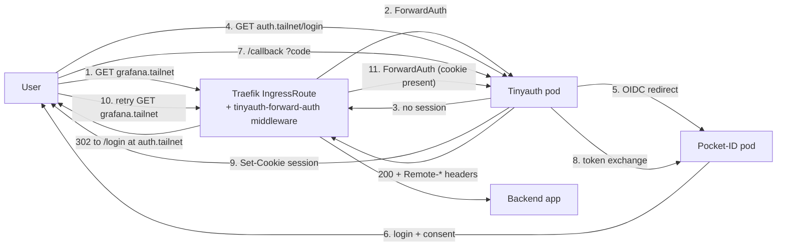

# `kubernetes/infrastructure/identity/`

Three controllers, one purpose: every other workload in the cluster delegates
authentication and tailnet membership to this directory.

| Controller | Role                                                    | Public surface                     |
| ---------- | ------------------------------------------------------- | ---------------------------------- |
| Pocket-ID  | OIDC IdP (single-source-of-truth for users + groups)    | `id.psimaker.org`                  |
| Tinyauth   | Forward-auth proxy for non-OIDC apps via Traefik        | `auth.tailnet` (cookie domain)     |
| Headscale  | Tailscale control-plane, ACL-as-code                    | `hs.psimaker.org`                  |

## Authentication flow



Apps that natively speak OIDC (Grafana, Beszel) bypass tinyauth and talk to
Pocket-ID directly. Apps that have no OIDC (Hubble UI, Prometheus, Longhorn
UI) sit behind the `tinyauth-forward-auth` Middleware.

## Headscale bootstrap

After the HelmRelease lands and Pocket-ID is reachable:

1. Exec into the headscale pod and create a user:
   ```bash
   kubectl exec -n identity deploy/headscale -- \
     headscale users create umut.erdem
   ```

2. Mint a pre-auth key for `tag:server`, valid 24 hours, reusable:
   ```bash
   kubectl exec -n identity deploy/headscale -- \
     headscale --user umut.erdem preauthkeys create \
       --reusable --expiration 24h \
       --tags tag:server
   ```
   The command prints a key like `1234abcd5678ef…`.

3. On each k3s node (edge, airbase) install the Tailscale client (Ansible
   handles this in production) and join:
   ```bash
   tailscale up \
     --login-server=https://hs.psimaker.org \
     --authkey=<key-from-step-2> \
     --advertise-tags=tag:server,tag:k8s \
     --advertise-routes=192.168.8.0/24    # airbase only
   ```

4. Verify on the headscale side:
   ```bash
   kubectl exec -n identity deploy/headscale -- headscale nodes list
   ```

5. Approve the advertised route from `airbase`:
   ```bash
   kubectl exec -n identity deploy/headscale -- \
     headscale routes enable --route-id <id-from-routes-list>
   ```

The ACL policy in `acl.hujson` is the source of truth for what each tag
can reach. It is reloaded via the ConfigMap mount on every Flux reconcile;
no `headscale apply` step is needed.

## Adding a new OIDC client

1. Add the client definition to `pocket-id/values.yaml` under `oidcClients`.
2. Push, let Flux reconcile.
3. In the Pocket-ID admin UI (`https://id.psimaker.org`), reveal the
   generated client secret.
4. Encrypt the secret into a SOPS-encrypted Secret in the consumer's
   directory, reference it from the workload's HelmRelease.
5. Document the new callback URL in this README.
